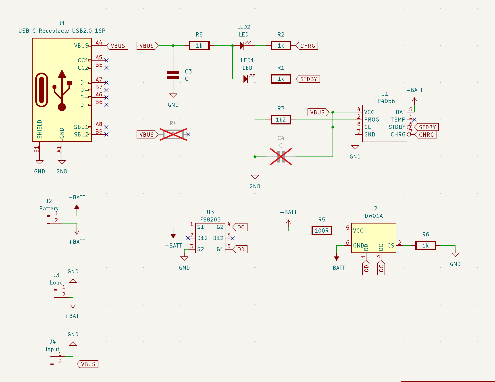

# TP4056 Reverse Engineering

Reverse engineering of [popular chineese board based on TP4056](https://aliexpress.ru/item/1005003331122808.html?sku_id=12000025253103024&spm=a2g2w.productlist.search_results.0.6b106147CeONqi), DW01A and FS8205A chips to control charge of single LiPo battery. 

